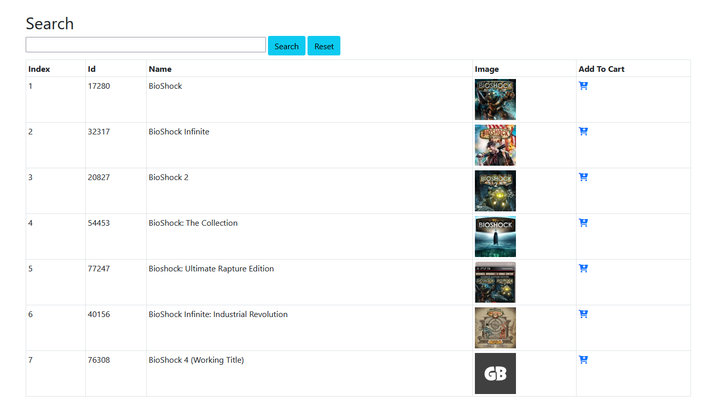
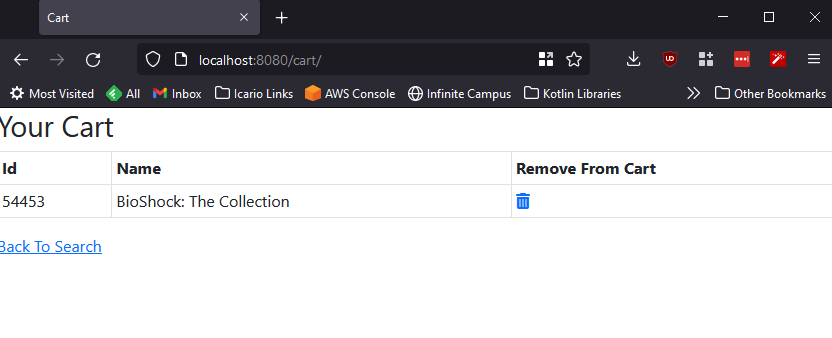

# Gravie Challenge

## Prerequisites
- Java SDK
- Gradle
- Docker

## Running the application
1. Start up the Mongo instance so that the app has something to persist to. run `docker-compose up` in the application directory. Note that Port `27017` must be available
2. Run the application `./gradlew bootrun`
3. Open a browser to http://localhost:8080
4. Search!

5. Add an Item to the cart

## Run the Tests
Run `./gradlew test` to execute the unit tests

## Notes
Don't ever commit an API Key to GH! This is for test purposes and will be revoked ASAP.
